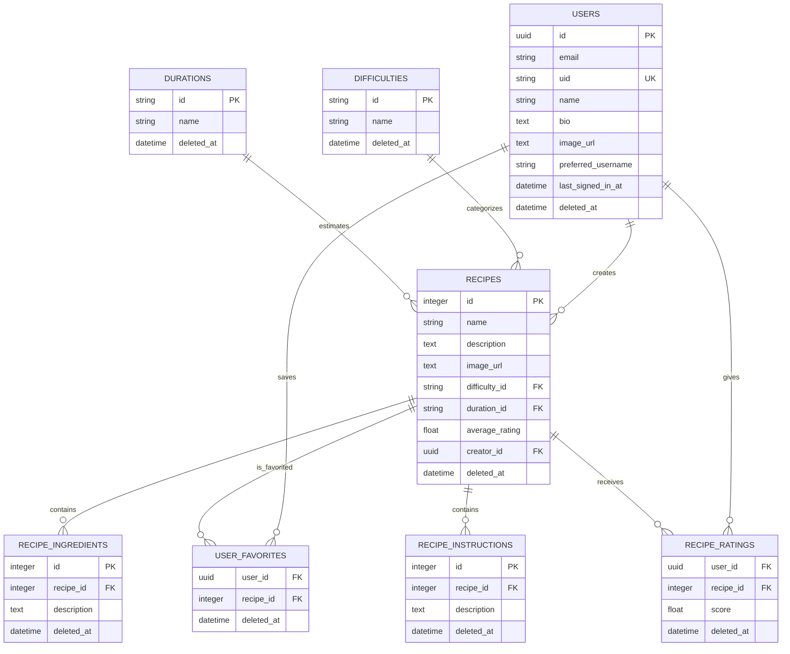

# Wongnok Domain Architecture

เอกสารนี้เป็นแหล่งอ้างอิงโครงสร้างข้อมูล (database/domain model) ของระบบ Wongnok
ตาม ER Diagram ปัจจุบัน

## ภาพรวมโดเมน

- **User** สร้างสูตรอาหาร, กดรายการโปรด, และให้คะแนนสูตรอาหารได้
- **Recipe** เป็นข้อมูลหลักของระบบ โดยระบุระดับความยากและระยะเวลาในการทำ
- **Recipe ingredient** และ **recipe instruction** เป็นรายการย่อยของสูตรอาหาร
- **Difficulty** และ **duration** เป็นข้อมูลอ้างอิง (reference data) ของสูตรอาหาร
- **User favorite** และ **recipe rating** เป็นความสัมพันธ์ระหว่างผู้ใช้กับสูตรอาหาร

## ER Diagram

## ตารางข้อมูล

| Table                 | หน้าที่                          | Primary key              | ความสัมพันธ์สำคัญ                                               |
| --------------------- | ----------------------------- | ------------------------ | ---------------------------------------------------------- |
| `users`               | บัญชีผู้ใช้                        | `id` (uuid)              | สร้าง `recipes`, บันทึก `user_favorites`, ให้ `recipe_ratings` |
| `difficulties`        | ระดับความยากของสูตร             | `id` (string)            | ถูกอ้างอิงโดย `recipes.difficulty_id`                         |
| `durations`           | ระยะเวลาทำอาหาร                | `id` (string)            | ถูกอ้างอิงโดย `recipes.duration_id`                           |
| `recipes`             | สูตรอาหาร                      | `id` (integer)           | อ้างอิงผู้สร้าง, difficulty และ duration                        |
| `recipe_ingredients`  | วัตถุดิบ/รายละเอียดวัตถุดิบของสูตร    | `id` (integer)           | อยู่ภายใต้ `recipes`                                          |
| `recipe_instructions` | ขั้นตอนทำอาหารของสูตร             | `id` (integer)           | อยู่ภายใต้ `recipes`                                          |
| `user_favorites`      | สูตรอาหารที่ผู้ใช้บันทึกเป็นรายการโปรด | (`user_id`, `recipe_id`) | join ระหว่าง `users` และ `recipes`                          |
| `recipe_ratings`      | คะแนนที่ผู้ใช้ให้สูตรอาหาร           | (`user_id`, `recipe_id`) | join ระหว่าง `users` และ `recipes`                          |

## รายละเอียดคอลัมน์และข้อกำหนด

### `users`

| Column                     | Type     | Constraints / Notes   |
| -------------------------- | -------- | --------------------- |
| `id`                       | uuid     | primary key, not null |
| `email`                    | string   | not null; indexed     |
| `name`                     | string   | nullable              |
| `bio`                      | text     | nullable              |
| `uid`                      | uid      | not null; unique      |
| `image_url`                | text     | nullable              |
| `preferred_username`       | string   | nullable              |
| `last_signed_in_at`        | datetime | nullable              |
| `created_at`, `updated_at` | datetime | not null              |
| `deleted_at`               | datetime | nullable; soft delete |

### `difficulties` และ `durations`

ทั้งสองตารางมีรูปแบบเดียวกัน: `id` (string, primary key, not null), `name`
(string, not null), `created_at`/`updated_at` (datetime, not null) และ `deleted_at`
(datetime, nullable) เพื่อรองรับ soft delete

#### Master data / migration seed

`difficulties` และ `durations` เป็น master data โดย migration ที่สร้างแต่ละตาราง
ต้อง seed รายการต่อไปนี้เมื่อ migration ทำงาน:

| Table          | `id`     | `name`           |
| -------------- | -------- | ---------------- |
| `difficulties` | `easy`   | Easy             |
| `difficulties` | `medium` | Medium           |
| `difficulties` | `hard`   | Hard             |
| `durations`    | `10m`    | 5 - 10 mins      |
| `durations`    | `30m`    | 10 - 30 mins     |
| `durations`    | `60m`    | ~1 Hour          |
| `durations`    | `long`   | More than 1 hour |

ค่า `id` เหล่านี้เป็นค่าคงที่ (stable values) ที่ `recipes.difficulty_id` และ
`recipes.duration_id` ใช้อ้างอิง จึงต้องไม่เปลี่ยนแปลง.

### `recipes`

| Column                     | Type     | Constraints / Notes                                       |
| -------------------------- | -------- | --------------------------------------------------------- |
| `id`                       | integer  | primary key, not null                                     |
| `name`                     | string   | not null                                                  |
| `description`              | text     | not null                                                  |
| `image_url`                | text     | nullable                                                  |
| `difficulty_id`            | string   | foreign key → `difficulties.id`; nullable ตาม schema ที่ระบุ |
| `duration_id`              | string   | foreign key → `durations.id`; nullable ตาม schema ที่ระบุ    |
| `average_rating`           | float    | not null; default `0`                                     |
| `creator_id`               | uuid     | foreign key → `users.id`; nullable ตาม schema ที่ระบุ        |
| `created_at`, `updated_at` | datetime | not null                                                  |
| `deleted_at`               | datetime | nullable; soft delete                                     |

### `recipe_ingredients` และ `recipe_instructions`

แต่ละรายการใช้ `id` (integer) เป็น primary key และมี `recipe_id` (integer) อ้างอิง
`recipes.id` พร้อม `description` (text, not null), `created_at`/`updated_at` (datetime,
not null) และ `deleted_at` (datetime, nullable) สำหรับ soft delete

### `user_favorites`

| Column                     | Type     | Constraints / Notes                  |
| -------------------------- | -------- | ------------------------------------ |
| `user_id`                  | uuid     | not null; foreign key → `users.id`   |
| `recipe_id`                | integer  | not null; foreign key → `recipes.id` |
| `created_at`, `updated_at` | datetime | not null                             |
| `deleted_at`               | datetime | nullable; soft delete                |

มี unique composite index ที่ `(`user_id`,` recipe_id`)` จึงมีได้เพียงหนึ่งรายการโปรดต่อผู้ใช้หนึ่งคนและสูตรหนึ่งรายการ

### `recipe_ratings`

| Column                     | Type     | Constraints / Notes                  |
| -------------------------- | -------- | ------------------------------------ |
| `user_id`                  | uuid     | not null; foreign key → `users.id`   |
| `recipe_id`                | integer  | not null; foreign key → `recipes.id` |
| `score`                    | float    | not null; default `0`                |
| `created_at`, `updated_at` | datetime | not null                             |
| `deleted_at`               | datetime | nullable; soft delete                |

มี unique composite index ที่ `(`user_id`,` recipe_id`)` จึงมีได้เพียงหนึ่งคะแนนต่อผู้ใช้หนึ่งคนและสูตรหนึ่งรายการ

## กติกาความสัมพันธ์

1. สูตรอาหารหนึ่งรายการอาจมีผู้สร้าง, difficulty และ duration อย่างละหนึ่งค่า เมื่อมีการกำหนด foreign key ดังกล่าว
2. สูตรอาหารหนึ่งรายการมี ingredient และ instruction ได้หลายรายการ
3. ผู้ใช้หนึ่งคนกด favorite และให้คะแนนสูตรอาหารได้หลายรายการ
4. ผู้ใช้คนเดิมสามารถ favorite หรือให้คะแนนสูตรเดิมได้อย่างละหนึ่งรายการเท่านั้น ตาม composite unique index
5. ทุกตารางใช้ `deleted_at` สำหรับ soft delete; การอ่านข้อมูลปกติควรพิจารณากรองแถวที่ `deleted_at IS NULL` ตามนโยบายของแอปพลิเคชัน

## การคำนวณ `average_rating`

`recipes.average_rating` เป็นค่าที่เก็บไว้บนสูตรอาหาร ในขณะที่คะแนนรายบุคคลอยู่ใน
`recipe_ratings.score` จึงควรกำหนดในชั้น service หรือ database transaction ว่าจะอัปเดต
ค่าเฉลี่ยทุกครั้งที่สร้าง แก้ไข ลบ หรือกู้คืน rating เพื่อให้ข้อมูลสอดคล้องกัน
